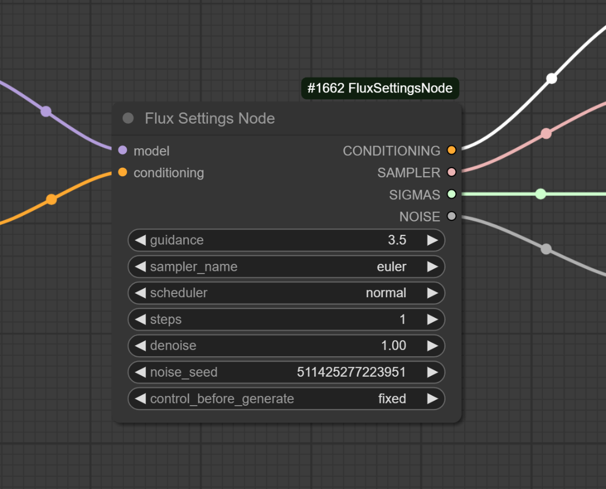

# FluxSettingsNode

**Version**: 1.1.1  
**Author**: [Light-x02](https://github.com/Light-x02)

## Support My Work
If you find this project useful, you can support my work on Ko-fi:  
[https://ko-fi.com/light_x02](https://ko-fi.com/light_x02)

## Description
FluxSettingsNode is a combined node for **ComfyUI** that merges the functionalities of the native nodes **FluxGuidance**, **KSamplerSelect**, **BasicScheduler**, and **RandomNoise** into one powerful and flexible tool. This node simplifies workflows by consolidating these features while enhancing their compatibility. It includes six tabs for switching between different configurations, saving fields like `guidance`, `sampler_name`, `scheduler`, `steps`, and `denoise` for each tab. This node simplifies workflows by consolidating these features while enhancing their compatibility.

## Compatibility
FluxSettingsNode is fully compatible with the extension [ComfyUI-ImageMetadataExtension](https://github.com/edelvarden/ComfyUI-ImageMetadataExtension). This integration ensures metadata compatibility with **Civitai**, allowing details such as sampler, steps, guidance, prompt, and seed to be correctly captured and displayed on the Civitai platform.

## Features
- **Combined Guidance**: Control guidance strength with precise adjustments.
- **Sampler and Scheduler Selection**: Choose your preferred sampler and Scheduler dynamically.
- **Flexible Scheduling**: Configure sigmas and denoise levels for advanced workflows.
- **Noise Management**: Generate random noise.
- **Streamlined Workflows**: Reduce complexity by integrating multiple nodes into one.
- **Six Tabs for Configuration Switching**: Effortlessly switch between up to six different configurations using tabs.
  - Saved fields per tab: `guidance`, `sampler_name`, `scheduler`, `steps`, and `denoise`.

## Installation

### Method 1: Install via ComfyUI Manager

2. Go to the **Custom Nodes** section in the interface.
3. Search for **"FluxSettingsNode"** and install it directly from the ComfyUI Manager.
4. **Restart ComfyUI**  
   Restart ComfyUI to load the node.

### Method 2: Clone the Repository
1. Open a terminal or command prompt.
2. Run the following command to clone the repository:
   ```bash
   git clone https://github.com/Light-x02/ComfyUI-FluxSettingsNode.git
   ```
3. **Restart ComfyUI**  
   Once the files are in place, restart ComfyUI to load the node.

### Manual Installation
1. **Download or Clone the Project**  
   [https://github.com/Light-x02/ComfyUI-FluxSettingsNode](https://github.com/Light-x02/ComfyUI-FluxSettingsNode)

2. **Move the Folder to Your ComfyUI Directory**  
   Copy the folder `ComfyUI-FluxSettingsNode` into the `custom_nodes` directory of your ComfyUI installation.

3. **Restart ComfyUI**  
   Once the files are in place, restart ComfyUI to load the node.

## Usage

### Included Functionalities

#### Guidance Control
- **Description**: Adjusts guidance strength dynamically to influence model behavior.

#### Sampler Selection
- **Description**: Dynamically selects a sampler for image generation.

#### Scheduling
- **Description**: Configures sigma and denoise settings for advanced workflows.

#### Noise Management
- **Description**: Generates random noise for specific workflows.

#### Tab-Based Configuration Switching
- **Description**: Utilize six tabs to manage multiple configurations within a single node.
- **Saved Fields**: Each tab independently saves the following fields:
  - `guidance`
  - `sampler_name`
  - `scheduler`
  - `steps`
  - `denoise`

### Example Workflow
1. Use the FluxSettingsNode to configure guidance, sampler, scheduling, and noise settings.
2. Switch between configurations using tabs to test different setups seamlessly.
3. Connect it to other nodes in your workflow.
4. Generate your image with streamlined and enhanced control.



## Additional Notes
This node is designed to work seamlessly with the ComfyUI ecosystem. Ensure you have the latest version of ComfyUI installed for the best experience.

## Contribution
Contributions are welcome! If you want to report a bug or suggest an improvement, open an issue or submit a pull request on the [GitHub repository](https://github.com/Light-x02/ComfyUI-FluxSettingsNode).

## Acknowledgements
This project incorporates code for the tab functionality provided by [ComfyUI-Flux-Continuum](https://github.com/robertvoy/ComfyUI-Flux-Continuum), under the MIT License. The code has been adjusted to fit seamlessly into the functionality of FluxSettingsNode. The original license is included below:

```
MIT License

Copyright (c) 2024 Robert

Permission is hereby granted, free of charge, to any person obtaining a copy
of this software and associated documentation files (the "Software"), to deal
in the Software without restriction, including without limitation the rights
to use, copy, modify, merge, publish, distribute, sublicense, and/or sell
copies of the Software, and to permit persons to whom the Software is
furnished to do so, subject to the following conditions:

The above copyright notice and this permission notice shall be included in all
copies or substantial portions of the Software.

THE SOFTWARE IS PROVIDED "AS IS", WITHOUT WARRANTY OF ANY KIND, EXPRESS OR
IMPLIED, INCLUDING BUT NOT LIMITED TO THE WARRANTIES OF MERCHANTABILITY,
FITNESS FOR A PARTICULAR PURPOSE AND NONINFRINGEMENT. IN NO EVENT SHALL THE
AUTHORS OR COPYRIGHT HOLDERS BE LIABLE FOR ANY CLAIM, DAMAGES OR OTHER
LIABILITY, WHETHER IN AN ACTION OF CONTRACT, TORT OR OTHERWISE, ARISING FROM,
OUT OF OR IN CONNECTION WITH THE SOFTWARE OR THE USE OR OTHER DEALINGS IN THE
SOFTWARE.
```
